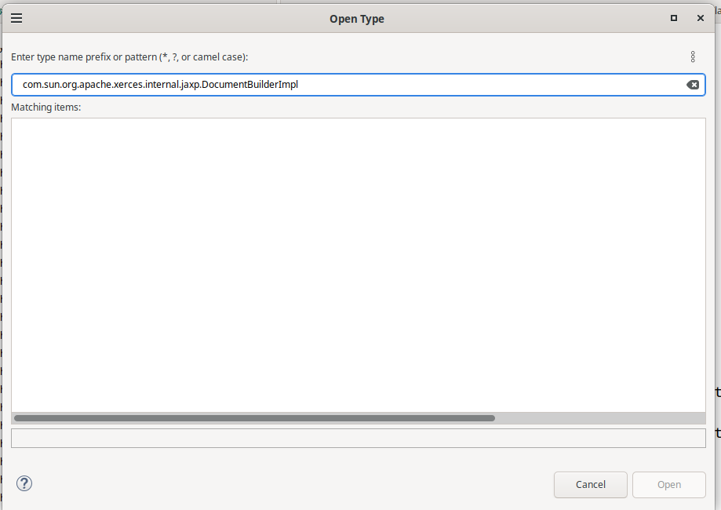
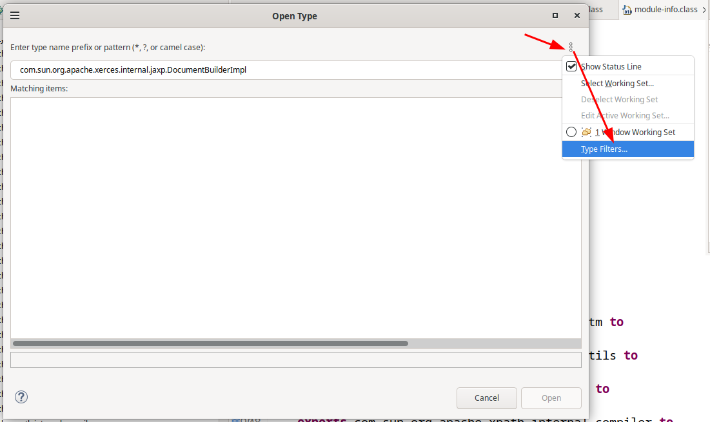
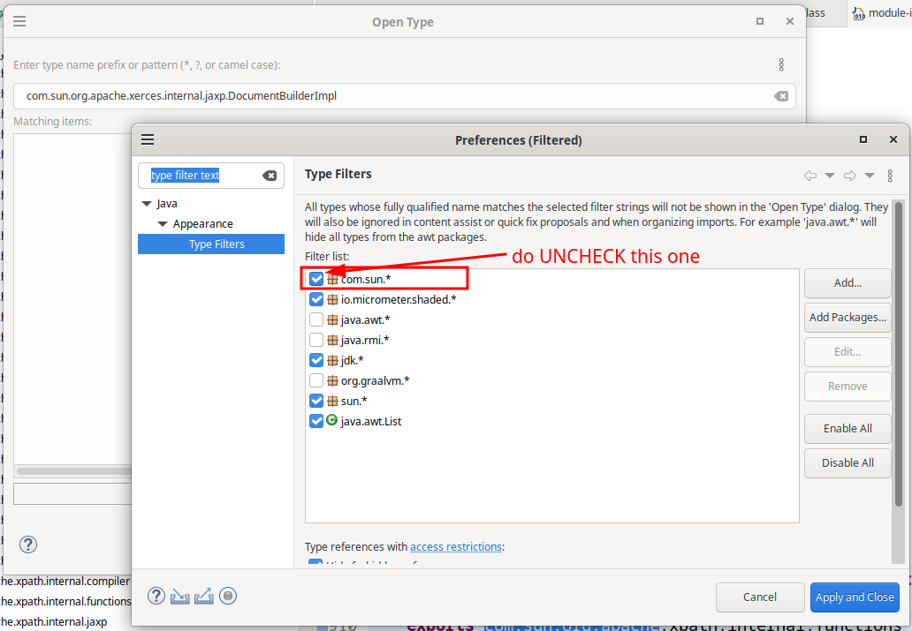
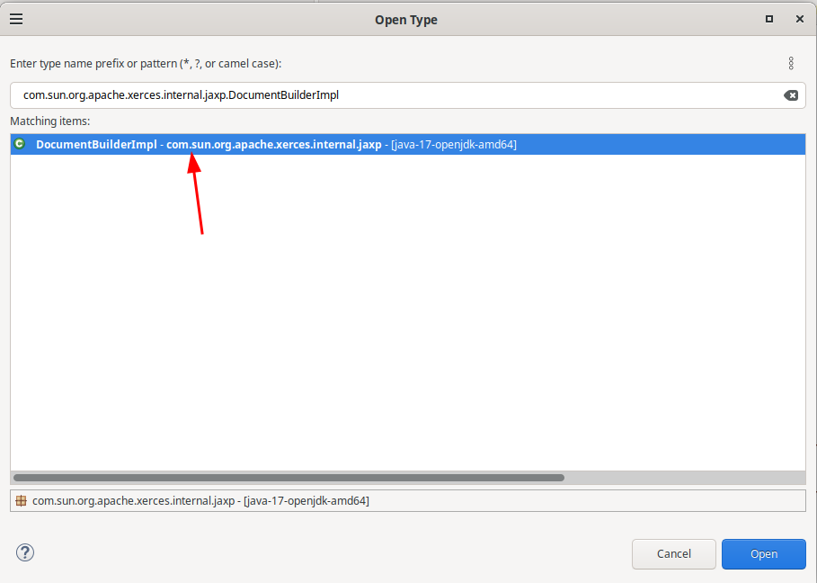

Sometime i can't find out some class on "java search", "open type dialog", "content assiist" as bellow

this because default eclipse filter some package. we can change by do like bellow

uncheck filter package

after apply class display on open type dialog

