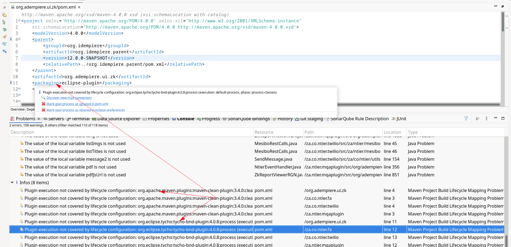
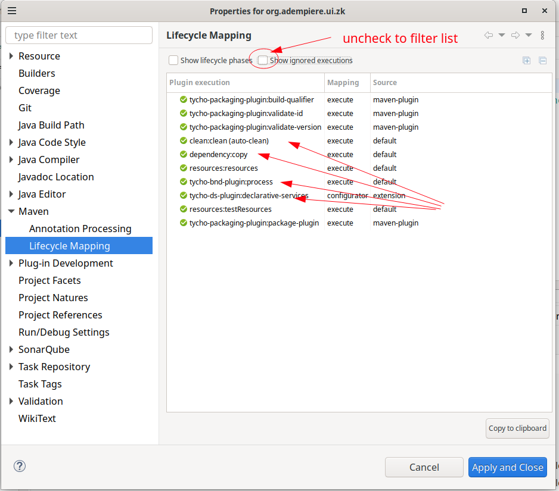
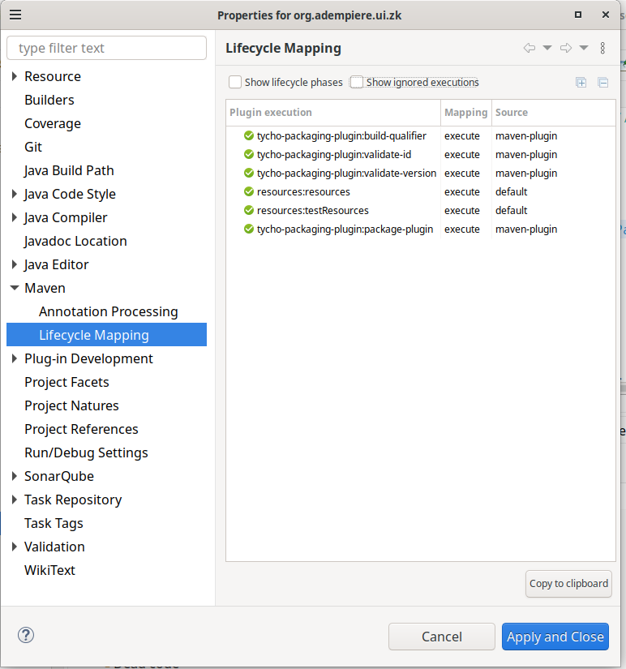

# Lifecycle Mapping Issue in Eclipse

When converting a customized plugin to a Maven project, it is typically necessary to use `org.idempiere.parent` as the parent POM.

There are two methods to reference the parent POM:

1. Adjust the `relativePath` to match the location of the parent POM.
2. Install `org.idempiere.parent` into the local Maven repository (by running `mvn install`).

### Issues with Each Method

- **Method 1**: Adjusting the `relativePath` becomes a nightmare when managing multiple customized plugins or using plugins from other sources.
- **Method 2**: Using the local Maven repository can lead to lifecycle mapping issues, as reported [here](https://github.com/eclipse-m2e/m2e-core/issues/1981). This issue is also noted at the end of this article.

### Workaround

To avoid these issues, follow these steps:

1. Group all customized plugins into a folder called `project.extra.bundle`.
2. Create a `sub.parent.pom.xml` file with the following content:

   ```xml
   <project xmlns="http://maven.apache.org/POM/4.0.0"
       xmlns:xsi="http://www.w3.org/2001/XMLSchema-instance"
       xsi:schemaLocation="http://maven.apache.org/POM/4.0.0 http://maven.apache.org/xsd/maven-4.0.0.xsd">
       <modelVersion>4.0.0</modelVersion>

       <groupId>org.idempiere</groupId>
       <artifactId>extra.sub.parent</artifactId>
       <version>1.0.0-SNAPSHOT</version>
       <packaging>pom</packaging>
       <name>Sub-parent for customized plugins</name>

       <parent>
           <groupId>org.idempiere</groupId>
           <artifactId>org.idempiere.parent</artifactId>
           <version>${revision}</version>
           <relativePath>[relative path to iDempiere workspace]/org.idempiere.parent/pom.xml</relativePath>
       </parent>
   </project>


   ```
3. Customize plugins use `sub.parent.pom.xml` as parent

   ```xml
   <project xmlns="http://maven.apache.org/POM/4.0.0" xmlns:xsi="http://www.w3.org/2001/XMLSchema-instance" xsi:schemaLocation="http://maven.apache.org/POM/4.0.0 http://maven.apache.org/xsd/maven-4.0.0.xsd">
     <modelVersion>4.0.0</modelVersion>
     <parent>
       <groupId>org.idempiere</groupId>
       <artifactId>extra.sub.parent</artifactId>
       <version>1.0.0-SNAPSHOT</version>
       <relativePath>../sub.parent.pom.xml</relativePath>
     </parent>
     <groupId>vn.mygroupplugin</groupId>
     <artifactId>myplugin</artifactId>
     <packaging>eclipse-plugin</packaging>
   </project>

   ```

that way manage relativePath at one place on sub.parent.pom.xml

### Redo Lifecycle Mapping Issue

to redo issue open "org.adempiere.ui.zk/pom.xml" change $`{revision}` to 12.0.0-SNAPSHOT and get same issue



effect pom on both case use $`{revision}` and 12.0.0-SNAPSHOT is identify

but life cycle mapping is difference

for use 12.0.0-SNAPSHOT



for use $`{revision}`


