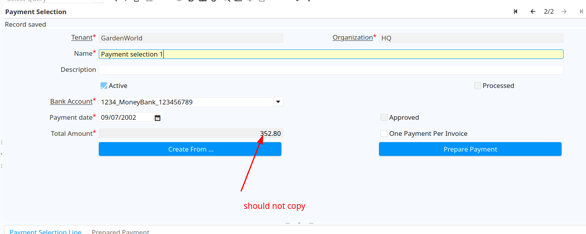

## Packout Org

1. it pack out AD_Client_ID so get NPE at bellow line on class PoFiller
   ```
   if (columnName.equals("AD_Client_ID") && ((Number)id).intValue() > 0) {
   ```
2. when resolve 1 by manual remove client_id get error duppilicate OrgInfo (same any window that auto genereate child record)
   because orgInfo auto create by afterSave of org,
   so value packin will duplicate
   this one maybe happend for all auto create chirend table
3. Model factory can't get MOrgInfo for table AD_OrgInfo
   because class MOrgInfo don't implement constructor support on ``AbstractModelFactory.getPO(Class<?> clazz, String tableName, int Record_ID, String trxName)``

POWrapper.invoke should cache method so don't need to lookup each time call to function?
