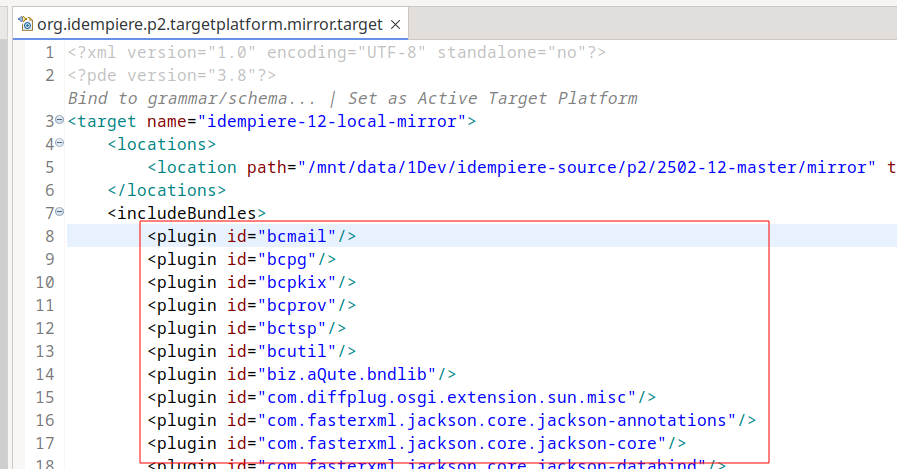
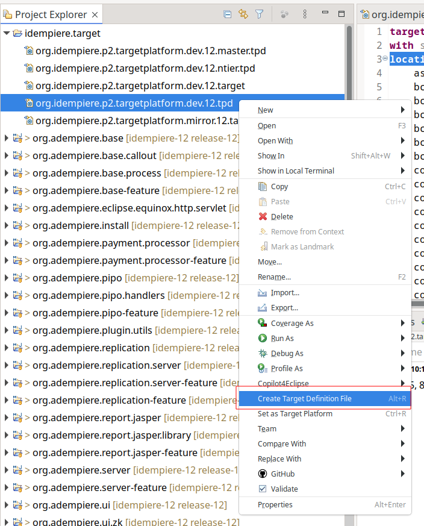

## Overview

When setup idempiere, load target platform take time (at first time it take about 30 munite)

It's more bad when each time we open target file also open eclipse it also take time to refresh (some time it freeze IDE)

It's because of eclipse and p2 repository, when buid by tycho it's not take long time like that but still not fast

[IDEMPIERE-5314](https://idempiere.atlassian.net/browse/IDEMPIERE-5314) and [IDEMPIERE-6108](https://idempiere.atlassian.net/browse/IDEMPIERE-6108) introdure a great way to speed up load target by use [tycho mirror](https://tycho.eclipseprojects.io/doc/main/target-platform-configuration/mirror-target-platform-mojo.html) it clone artifact to local

But mirror target don't include source from some type of p2.repository [report here](https://github.com/eclipse-tycho/tycho/discussions/3926#discussioncomment-11027194)

it make hard when debug

## Create local target platform with source artifact
1. Clone idempiere source and checkout branch release-12 (it's ok for 11 or master)

2. [Create local repository with source](https://tycho.eclipseprojects.io/doc/main/tycho-p2-repository-plugin/assemble-repository-mojo.html#includeAllSources)

   Open org.idempiere.p2/pom.xml and add `<includeAllSources>`

   <details>
   <summary>Add includeAllSources</summary>

   ```XML
   <plugin>
   	<groupId>org.eclipse.tycho</groupId>
   	<artifactId>tycho-p2-repository-plugin</artifactId>
   	<executions>
   		<execution>
   			<id>default-assemble-repository</id>
   			<goals>
   				<goal>assemble-repository</goal>
   			</goals>
   			<phase>${assembleRepository}</phase>
   		</execution>
   		<execution>
   			<id>default-archive-repository</id>
   			<goals>
   				<goal>archive-repository</goal>
   			</goals>
   			<phase>${assembleRepository}</phase>
   		</execution>
   	</executions>
   	<configuration>
   		<!-- from import package maven can lookup bundle from all repositorys 
   			declare on target platform, also maven local so default generated site-p2 
   			don't include that bundle. this configuration change default behavior -->
   		<includeAllDependencies>true</includeAllDependencies>
   		<includeAllSources>true</includeAllSources>
   		<!-- https://bugs.eclipse.org/bugs/show_bug.cgi?id=512396 -->
   		<xzCompress>false</xzCompress>
   	</configuration>
   </plugin>

   ```

   </details>

3. Create p2 repository
    Run `mvn verify -Dtycho.buildqualifier.format=yyyyMMdd`
    Now we has a p2 repository at `[idempiere-source]/org.idempiere.p2/target/repository` with bellow feature

    * bundle with artifact source
    * include idempiere bundle (org.idempiere, org.adempiere, org.compiere,...)
    * missing bundle for run junit

    copy and rename `[idempiere-source]/org.idempiere.p2/target/repository` `~/target/idempiere-dev-12`
    copy and rename `idempiere-12/org.idempiere.p2.targetplatform/target/target-platform-repository` `~/target/idempiere-mirror-12`

4. get list artifac
    * setup update eclipse with idempiere source
    * open org.idempiere.p2.targetplatform.mirror
    * go to tab content and unselect a bundle
    * go to source tab to get list of bundle
    
    * process text `<plugin id="bcmail"/>` to get name (bcmail) only
    * has some bunlde has multi version need to special process
        * com.sun.xml.fastinfoset.FastInfoset
        * org.apache.ws.xmlschema.core
        ```
        com.sun.xml.fastinfoset.FastInfoset" version="2.0.0
	    com.sun.xml.fastinfoset.FastInfoset" version="1.2.18.v202109010034
        ```
        to
        ```
        com.sun.xml.fastinfoset.FastInfoset [2.0.0,2.0.0]
	    com.sun.xml.fastinfoset.FastInfoset [1.2.18,1.2.18]
        // com.sun.xml.fastinfoset.FastInfoset" version="2.0.0
	    // com.sun.xml.fastinfoset.FastInfoset" version="1.2.18.v202109010034
        ```
    * comment list of bellow bundle because isn't inside idempiere product so isn't output to repository when run `target-platform-repository`
        ```
        biz.aQute.bndlib
        com.sun.xml.bind.external.rngom
        org.apache.cxf.cxf-rt-transports-local
        org.apache.santuario.xmlsec
        org.eclipse.equinox.launcher.cocoa.macosx
        org.eclipse.equinox.launcher.cocoa.macosx.aarch64
        org.eclipse.equinox.launcher.gtk.linux.aarch64
        org.eclipse.equinox.launcher.gtk.linux.ppc64le
        org.eclipse.jdt.junit5.runtime
        org.osgi.service.obr
        wrapped.com.beust.jcommander
        wrapped.com.github.virtuald.curvesapi
        wrapped.com.google.j2objc.j2objc-annotations
        wrapped.de.rototor.pdfbox.graphics2d
        wrapped.org.apache.activemq.activemq-broker
        wrapped.org.jboss.spec.javax.rmi.jboss-rmi-api_1.0_spec
        wrapped.org.mortbay.jetty.quiche.jetty-quiche-native
        wrapped.xml-resolver.xml-resolver
        ```
    * moment has bellow error so comment out that bundle (with error version) also
        ```
        No installable unit with ID 'com.sun.xml.fastinfoset.FastInfoset' can be found with range constraint '[1.2.18,1.2.18]'
        No installable unit with ID 'org.apache.ws.xmlschema.core' can be found with range constraint '[2.2.5,2.2.5]'
        ```
    * manual add bundle unselect above
    * create a new project call org.idempiere.target inside ~/target (become ~/target/org.idempiere.target)
    * inside org.idempiere.target create file `org.idempiere.p2.targetplatform.12.dev.tpd` (can dupplicate org.idempiere.p2.targetplatform.tpd)
    * inside org.idempiere.target create file `org.idempiere.p2.targetplatform.12.mirror.target` (can dupplicate org.idempiere.p2.targetplatform.mirror.target)

5. edit file `org.idempiere.target/org.idempiere.target/org.idempiere.p2.targetplatform.12.dev.tpd`
    * delete all location keep only one
    * modify location to `location all "file:/home/[user]/target/idempiere-dev-12" {`
    * apppend list of artifact on step 4 to location
    * right click to file `org.idempiere.p2.targetplatform.12.dev.tpd` and choose "create targe defintion file" to generate file `org.idempiere.p2.targetplatform.12.dev.target`
    

6. edit file `org.idempiere.target/org.idempiere.p2.targetplatform.12.mirror.target`
    * change value of path from `${project_loc:org.idempiere.p2.targetplatform}/target/target-platform-repository` to `/home/[user]/target/idempiere-mirror-12`

## Result
From now, each time we setup idempiere workspace, just import project `org.idempiere.target` to eclipse and active target up to purpose
* for debug just open and active `org.idempiere.p2.targetplatform.12.dev.target`
* for run unittest just open and active `org.idempiere.p2.targetplatform.12.mirror.target`

## Note
why list bundle on `~/target/idempiere-dev-12` difference `~/target/idempiere-mirror-12`?

because ~/target/idempiere-mirror-12 base on target file but idempiere-dev-12 base on idempiere product