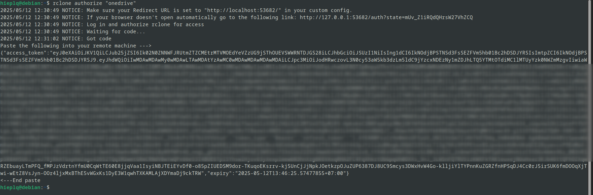
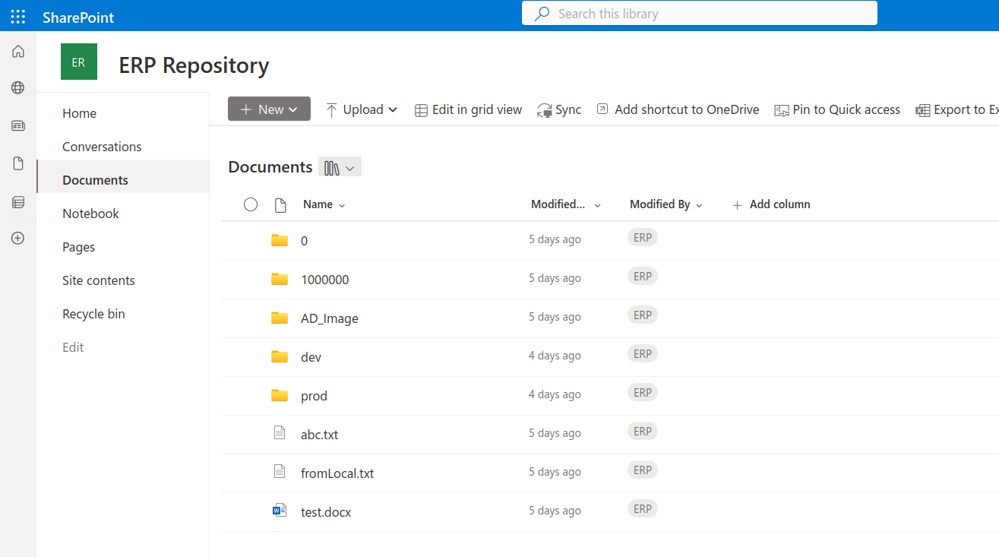
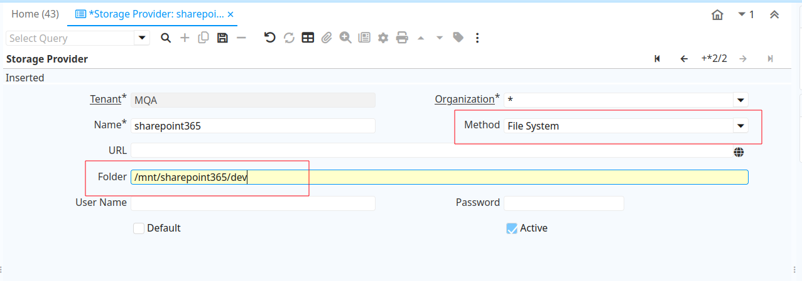
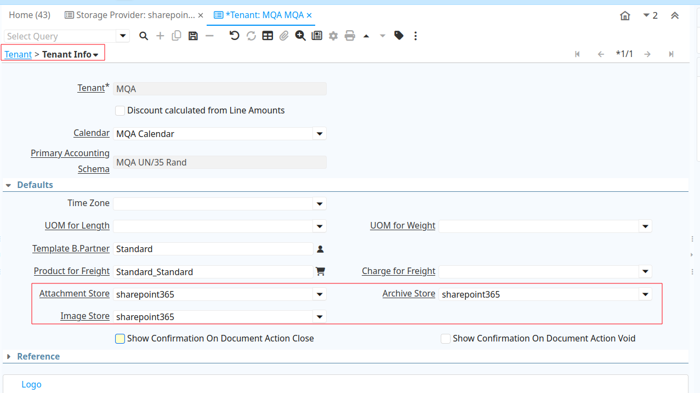
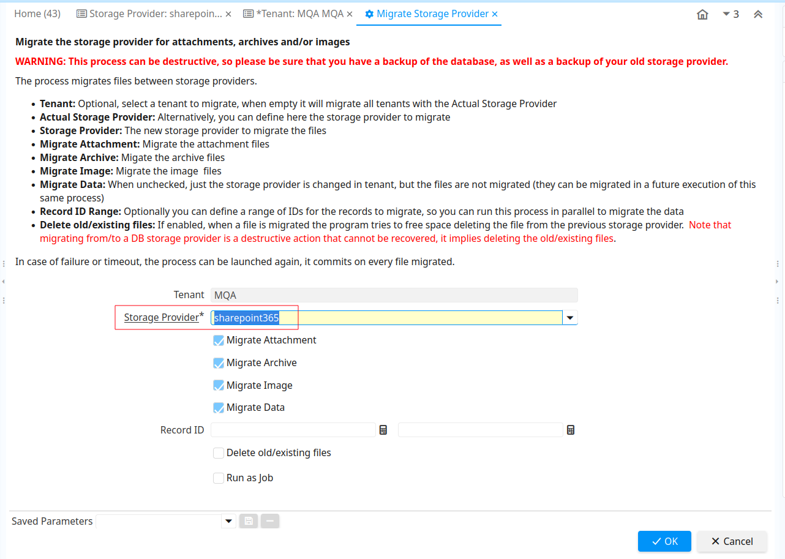

By default idempiere store file to database

Has build Storage Providers to use file system

How about to use remote Storage like gdrive, ondrive, sharepoint,...?

Implement a new Storage Providers for each remote Storage is a option, this guide help you use rclone and build-in file system Storage Providers to use remoate Storage

i use sharepoint-356 as example for remote storage you can find out more storage supposted by rclone [here](https://github.com/rclone/rclone?tab=readme-ov-file#storage-providers)

## install rclone latest version

```bash
curl https://rclone.org/install.sh | sudo bash
rclone version
```

## Configuraion Rclone

I reference this document [link 1](https://rclone.org/onedrive/#excessive-throttling-or-blocked-on-sharepoint) and [link 2](https://rclone.org/remote_setup/)

```bash
rclone config
e) Edit existing remote
n) New remote
d) Delete remote
r) Rename remote
c) Copy remote
s) Set configuration password
q) Quit config
e/n/d/r/c/s/q>n
```

1. choose n for create new one

```bash
Enter name for new remote.
name> sharepoint365
```

2. namming your configuration

```bash
Option Storage.
Type of storage to configure.
Choose a number from below, or type in your own value.
 1 / 1Fichier
   \ (fichier)
 2 / Akamai NetStorage
   \ (netstorage)
 3 / Alias for an existing remote
   \ (alias)
 4 / Amazon S3 Compliant Storage Providers including AWS, Alibaba, ArvanCloud, Ceph, ChinaMobile, Cloudflare, DigitalOcean, Dreamhost, GCS, HuaweiOBS, IBMCOS, IDrive, IONOS, LyveCloud, Leviia, Liara, Linode, Magalu, Minio, Netease, Outscale, Petabox, RackCorp, Rclone, Scaleway, SeaweedFS, Selectel, StackPath, Storj, Synology, TencentCOS, Wasabi, Qiniu and others
   \ (s3)
 5 / Backblaze B2
   \ (b2)
 6 / Better checksums for other remotes
   \ (hasher)
 7 / Box
   \ (box)
...
34 / Microsoft Azure Blob Storage
   \ (azureblob)
35 / Microsoft Azure Files
   \ (azurefiles)
36 / Microsoft OneDrive
   \ (onedrive)
37 / OpenDrive
   \ (opendrive)
38 / OpenStack Swift (Rackspace Cloud Files, Blomp Cloud Storage, Memset Memstore, OVH)
   \ (swift)
...
Storage>36
```

3. up to rclone version, list can be difference so input can be difference. on mine i find out for "Microsoft OneDrive" and input its number (36)

```bash
Option client_id.
OAuth Client Id.
Leave blank normally.
Enter a value. Press Enter to leave empty.
client_id> 
```

4. leave empty for defaul

```bash
Option client_secret.
OAuth Client Secret.
Leave blank normally.
Enter a value. Press Enter to leave empty.
client_secret> 
```

5. leave empty for defaul

```bash
Option region.
Choose national cloud region for OneDrive.
Choose a number from below, or type in your own value of type string.
Press Enter for the default (global).
 1 / Microsoft Cloud Global
   \ (global)
 2 / Microsoft Cloud for US Government
   \ (us)
 3 / Microsoft Cloud Germany (deprecated - try global region first).
   \ (de)
 4 / Azure and Office 365 operated by Vnet Group in China
   \ (cn)
region> 
```

6. leave empty for defaul

```bash
Option tenant.
ID of the service principal's tenant. Also called its directory ID.
Set this if using
- Client Credential flow
Enter a value. Press Enter to leave empty.
tenant>
```

7. leave empty for defaul

```bash
Edit advanced config?
y) Yes
n) No (default)
y/n>
```

8. input n for keep defaul

```bash
Use web browser to automatically authenticate rclone with remote?
 * Say Y if the machine running rclone has a web browser you can use
 * Say N if running rclone on a (remote) machine without web browser access
If not sure try Y. If Y failed, try N.

y) Yes (default)
n) No
y/n>N
```

9. input N because i configuration for server throw ssh

```bash
Option config_token.
For this to work, you will need rclone available on a machine that has
a web browser available.
For more help and alternate methods see: https://rclone.org/remote_setup/
Execute the following on the machine with the web browser (same rclone
version recommended):
	rclone authorize "onedrive"
Then paste the result.
Enter a value.
config_token> 
```

10. run [rclone authorize "onedrive"] on PC has webbrowse, after authenticate by browse back to terminal to copy token and paste to here



```bash
Option config_type.
Type of connection
Choose a number from below, or type in an existing value of type string.
Press Enter for the default (onedrive).
 1 / OneDrive Personal or Business
   \ (onedrive)
 2 / Root Sharepoint site
   \ (sharepoint)
   / Sharepoint site name or URL
 3 | E.g. mysite or https://contoso.sharepoint.com/sites/mysite
   \ (url)
 4 / Search for a Sharepoint site
   \ (search)
 5 / Type in driveID (advanced)
   \ (driveid)
 6 / Type in SiteID (advanced)
   \ (siteid)
   / Sharepoint server-relative path (advanced)
 7 | E.g. /teams/hr
   \ (path)
config_type>4
```

11. i choose 4 to search site on sharepoint i already prepare
    

```bash
Option config_search_term.
Search term
Enter a value.
config_search_term> ERPRepository
```

12. input site name of sharepoint for search

```bash
Option config_site.
Select the Site you want to use
Choose a number from below, or type in your own value of type string.
Press Enter for the default ([mydomain].sharepoint.com,xxx).
 1 / ERP Repository (https://[mydomain].sharepoint.com/sites/ERPRepository)
   \ ([mydomain].sharepoint.com,xxx)
config_site> 1
```

13. verify site name to choose correct site (here i choose 1)

```bash
Option config_driveid.
Select drive you want to use
Choose a number from below, or type in your own value of type string.
Press Enter for the default (document identify).
 1 / Documents (documentLibrary)
   \ (document identify)
config_driveid>1
```

14. choose folder to sync (here i choose document, next step will add subfolder for separate prod and dev environment)

```bash
Drive OK?

Found drive "root" of type "documentLibrary"
URL: https://[my domain].sharepoint.com/sites/ERPRepository/Shared%20Documents

y) Yes (default)
n) No
y/n> y
```

15. confirm choosed folder

```bash
Configuration complete.
Options:
- type: onedrive
- token: {"access_token":""}
- drive_id: document identify
- drive_type: documentLibrary
Keep this "sharepoint365" remote?
y) Yes this is OK (default)
e) Edit this remote
d) Delete this remote
y/e/d> y
```

16. yes to save configuration

```bash
Current remotes:

Name                 Type
====                 ====
sharepoint365        onedrive

e) Edit existing remote
n) New remote
d) Delete remote
r) Rename remote
c) Copy remote
s) Set configuration password
q) Quit config
e/n/d/r/c/s/q>q
```

17. input q to quit configuation


configuration is store at ~/.config/rclone/rclone.conf you can refine configuration by edit this file

## Configuration rclone to mount remote folder to local and always run on system start without user login

```bash
sudo su -
export idempiereUser=idempiere
export mountPoint=/mnt/sharepoint365
mkdir -p $mountPoint
chown $idempiereUser:$idempiereUser $mountPoint
```

1. Create mount point and set right for idempiere user


```bash
export serviceFilePath=/etc/systemd/system/rclone-mount.service
export remoteMount=sharepoint365
# configuration name
export configPath=/home/$idempiereUser/.config/rclone/rclone.conf

cat << EOF >> $serviceFilePath
[Unit]
Description=Mount Rclone Remote
After=network-online.target
Wants=network-online.target

[Service]
Type=notify
ExecStart=/usr/bin/rclone mount $remoteMount: $mountPoint \
  --config=$configPath \
  --vfs-cache-mode writes \
  --allow-other \
  --umask 002 \
  --daemon-timeout 5m
Restart=on-failure
User=$idempiereUser
Group=$idempiereUser

[Install]
WantedBy=default.target

EOF

# for --allow-other option
sed -i -r "s|^#user_allow_other|user_allow_other|" /etc/fuse.conf
cat /etc/fuse.conf | grep user_allow_other

systemctl daemon-reexec
systemctl daemon-reload
systemctl enable rclone-mount.service
systemctl start rclone-mount.service

export devMountPoint=$mountPoint/dev
mkdir -p $devMountPoint
chown $idempiereUser:$idempiereUser $devMountPoint


# on server mode for security don't use option --allow-other
# The --allow-other option in rclone mount (and other FUSE-based mounts) allows users other than the one who ran the command to access the mounted filesystem

```

2. create service for auto run

3. configuration Storage Provider on idempiere (can be on Tenant or System level)





4. run "Migrate Storage Provider" to move current file (on database) to new Storage Provider

