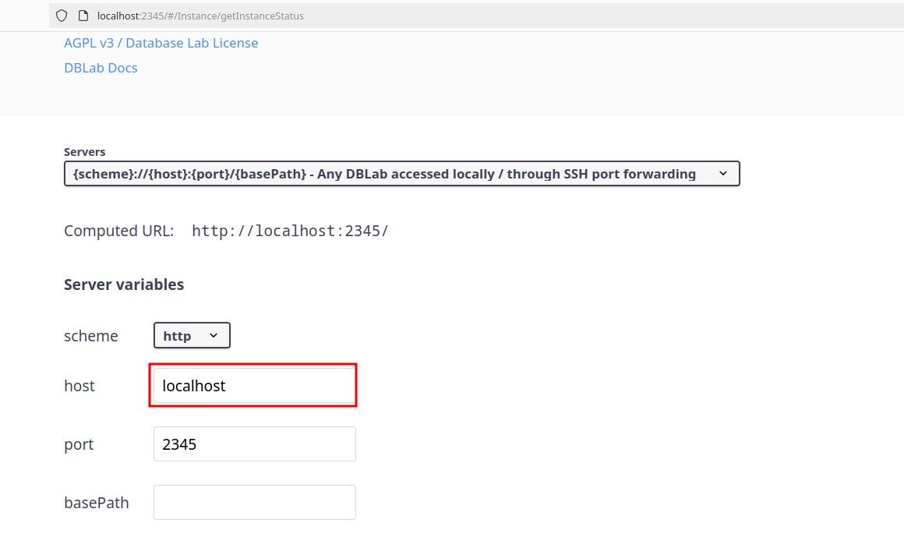
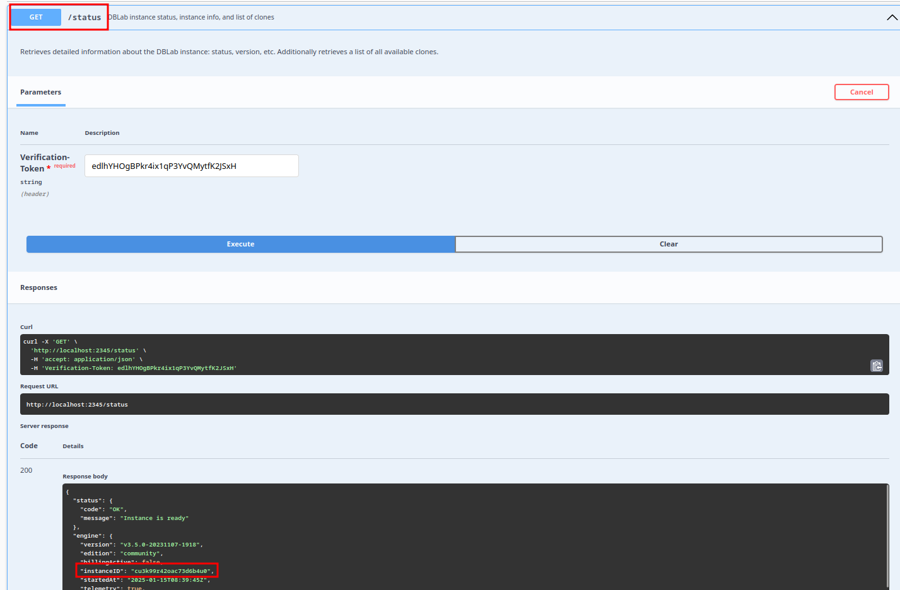

## install follow [guide](https://postgres.ai/docs/how-to-guides/administration/install-dle-manually)

**change server.yml to fix issue report [here](https://github.com/postgres-ai/database-lab-engine/issues/227)**

```
export DBLAB_DISK=/dev/sda3
sudo docker run \
  --name dblab_server \
  --label dblab_control \
  --privileged \
  --publish 127.0.0.1:2345:2345 \
  --volume /var/run/docker.sock:/var/run/docker.sock \
  --volume /var/lib/dblab:/var/lib/dblab/:rshared \
  --volume ~/.dblab/engine/configs:/home/dblab/configs \
  --volume ~/.dblab/engine/meta:/home/dblab/meta \
  --volume ~/.dblab/engine/logs:/home/dblab/logs \
  --volume /sys/kernel/debug:/sys/kernel/debug:rw \
  --volume /lib/modules:/lib/modules:ro \
  --volume /proc:/host_proc:ro \
  --env DOCKER_API_VERSION=1.39 \
  --detach \
  --restart on-failure \
  postgresai/dblab-server:3.5.0
```

## Use webui to call api

Datalab docker public a webui to call api to execute function but default it use 127.0.0.1 for host need to change to localhost



## Use cli

can use cli from host to call datalab engine on docker but we can install cli on datalab docker also

docker exec -ti dblab_server  bash

```
# datalab docker extend from docker it's extend from Alpine
apk add curl
cd scripts
bash cli_install.sh
```

to init enviroment for cli need value for environment-id, get that value by do bellow



```
# to get --environment-id acces to http://localhost:2345 and do

dblab init --environment-id=cu3k99r42oac73d6b4u0 --url=http://localhost:2345 --token=edlhYHOgBPkr4ix1qP3YvQMytfK2JSxH
dblab clone create --username adempiere --password adempiere@12

```
